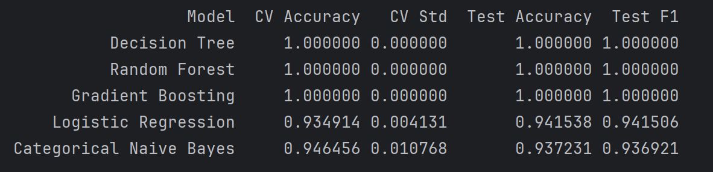
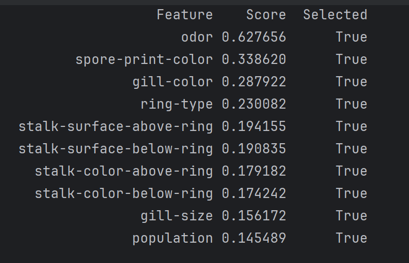
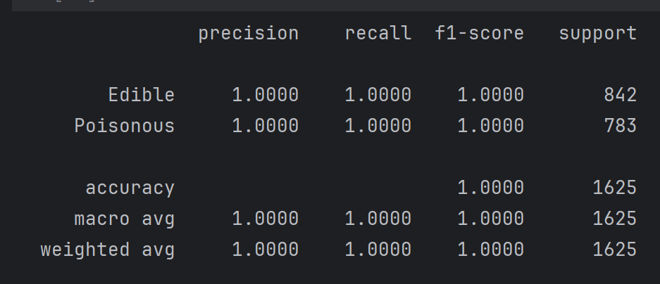

# Mushroom Classification: Edible vs Poisonous

A machine learning project that predicts whether a mushroom is edible or poisonous based on its physical characteristics. This project demonstrates end-to-end ML pipeline development, from exploratory data analysis to model deployment.

## Project Overview

**Problem Statement:** Given the physical characteristics of a mushroom, predict whether it is edible or poisonous. This is a critical binary classification problem with significant real-world implications for food safety.

**Why This Matters:** Mushroom poisoning can be fatal, and visual identification is often unreliable even for experts. A robust classification model can serve as a decision support tool for mushroom identification.

## Dataset Description

**Source:** [UCI Machine Learning Repository - Mushroom Dataset](https://archive.ics.uci.edu/ml/datasets/mushroom)

**Size:** 8,124 instances with 22 categorical features (plus 1 target variable)

**Target Variable:** 
- **class**: Edible (e) or Poisonous (p)
- **Class Distribution:** 
  - Edible: 4,208 (51.8%)
  - Poisonous: 3,916 (48.2%)
  - *Well-balanced dataset - no class imbalance issues*

**Features:** All features are categorical with the following attributes:

1. **cap-shape**: bell (b), conical (c), convex (x), flat (f), knobbed (k), sunken (s)
2. **cap-surface**: fibrous (f), grooves (g), scaly (y), smooth (s)
3. **cap-color**: brown (n), buff (b), cinnamon (c), gray (g), green (r), pink (p), purple (u), red (e), white (w), yellow (y)
4. **bruises**: bruises (t), no (f)
5. **odor**: almond (a), anise (l), creosote (c), fishy (y), foul (f), musty (m), none (n), pungent (p), spicy (s)
6. **gill-attachment**: attached (a), descending (d), free (f), notched (n)
7. **gill-spacing**: close (c), crowded (w), distant (d)
8. **gill-size**: broad (b), narrow (n)
9. **gill-color**: black (k), brown (n), buff (b), chocolate (h), gray (g), green (r), orange (o), pink (p), purple (u), red (e), white (w), yellow (y)
10. **stalk-shape**: enlarging (e), tapering (t)
11. **stalk-root**: bulbous (b), club (c), cup (u), equal (e), rhizomorphs (z), rooted (r), missing (?)
12. **stalk-surface-above-ring**: fibrous (f), scaly (y), silky (k), smooth (s)
13. **stalk-surface-below-ring**: fibrous (f), scaly (y), silky (k), smooth (s)
14. **stalk-color-above-ring**: brown (n), buff (b), cinnamon (c), gray (g), orange (o), pink (p), red (e), white (w), yellow (y)
15. **stalk-color-below-ring**: brown (n), buff (b), cinnamon (c), gray (g), orange (o), pink (p), red (e), white (w), yellow (y)
16. **veil-type**: partial (p), universal (u)
17. **veil-color**: brown (n), orange (o), white (w), yellow (y)
18. **ring-number**: none (n), one (o), two (t)
19. **ring-type**: cobwebby (c), evanescent (e), flaring (f), large (l), none (n), pendant (p), sheathing (s), zone (z)
20. **spore-print-color**: black (k), brown (n), buff (b), chocolate (h), green (r), orange (o), purple (u), white (w), yellow (y)
21. **population**: abundant (a), clustered (c), numerous (n), scattered (s), several (v), solitary (y)
22. **habitat**: grasses (g), leaves (l), meadows (m), paths (p), urban (u), waste (w), woods (d)

**Data Quality Issues:**
- Missing values in `stalk-root` (30.5% missing, encoded as '?')
- One constant feature (`veil-type`) that provides no discriminative information
- Some rare categories in certain features that may affect model generalization

## Installation

### Prerequisites
- Python 3.8+
- pip package manager

### Setup

1. Clone the repository:
```bash
git clone https://github.com/lizakolosova/machine-learning-lifecycle.git
```

2. Create a virtual environment:
```bash
python -m venv venv
source venv/bin/activate  # On Windows: venv\Scripts\activate
```

3. Install dependencies:
```bash
pip install -r requirements.txt
```

## Usage

### 1. Exploratory Data Analysis
Run the EDA notebook to understand the dataset:
```bash
jupyter notebook data-understanding.ipynb
```

### 2. Data Preprocessing
Execute the preprocessing pipeline:
```bash
jupyter notebook implementation-and-data-pipeline.ipynb
```

### 3. Model Selection
Train and compare multiple models:
```bash
jupyter notebook model-selection-and-justification.ipynb
```

### 4. Model Evaluation
Analyze the final model performance:
```bash
jupyter notebook evaluation-and-analysis.ipynb
```

### 5. API Deployment
Deploy the model as a REST API:
```bash
cd lifecycleproject
uvicorn api:app --reload
```

Access the API documentation at: `http://localhost:8000/docs`

### 6. Making Predictions

**Using the API:**
```python
import requests

mushroom_data = {
  "cap-shape": "x",
  "cap-surface": "s",
  "cap-color": "y",
  "bruises": "t",
  "odor": "a",
  "gill-attachment": "f",
  "gill-spacing": "c",
  "gill-size": "b",
  "gill-color": "k",
  "stalk-shape": "e",
  "stalk-root": "b",
  "stalk-surface-above-ring": "o",
  "stalk-surface-below-ring": "s",
  "stalk-color-above-ring": "w",
  "stalk-color-below-ring": "w",
  "veil-type": "p",
  "veil-color": "w",
  "ring-number": "o",
  "ring-type": "p",
  "spore-print-color": "n",
  "population": "n",
  "habitat": ""
}

response = requests.post("http://localhost:8000/predict", json=mushroom_data)
print(response.json())  # {"prediction": "p"} or {"prediction": "e"}
```

**Using the pipeline directly:**

```python
import joblib
import pandas as pd

# Load the pipeline
pipeline = joblib.load("lifecycleproject/artifacts/final_mushroom_pipeline.pkl")
prep_pkg = joblib.load("lifecycleproject/artifacts/mushroom_preprocessing_pipeline.pkl")
target_encoder = prep_pkg["target_encoder"]

# Prepare input
X_input = pd.DataFrame([{
    "cap-shape": "x",
    "cap-surface": "s",
    # ... all features
}])

# Predict
prediction = pipeline.predict(X_input)
label = target_encoder.inverse_transform(prediction)[0]
print(f"Prediction: {'Edible' if label == 'e' else 'Poisonous'}")
```

## Methodology

### 1. Data Understanding & EDA
- Comprehensive statistical analysis of all features
- Missing value analysis and impact assessment
- Distribution analysis and relationship exploration
- Feature correlation investigation

### 2. Data Preprocessing Pipeline
- **Missing Value Handling:** Mode imputation for categorical features (fitted only on training data)
- **Feature Encoding:** One-Hot Encoding for nominal features, Label Encoding for ordinal features
- **Feature Selection:** Removal of constant features and low-variance features
- **Rare Category Handling:** Grouping rare categories (< 1% frequency) into 'Other'
- **Data Leakage Prevention:** All transformations fitted only on training data

### 3. Model Selection
**Models Evaluated:**
- Dummy Classifier (random baseline)
- Logistic Regression
- Decision Tree Classifier
- Random Forest Classifier
- Gradient Boosting Classifier
- Support Vector Machine
- K-Nearest Neighbors
- Naive Bayes

**Evaluation Strategy:**
- 80-20 train-test split with stratification
- 5-fold cross-validation
- Multiple metrics: Accuracy, Precision, Recall, F1-Score, ROC-AUC

**Hyperparameter Tuning:**
- GridSearchCV for exhaustive search
- RandomizedSearchCV for large search spaces
- Validation curves for hyperparameter analysis

### 4. Model Justification
**Why Accuracy is Appropriate:**
- Balanced dataset (51.8% vs 48.2%)
- Equal costs for false positives and false negatives (both are dangerous)
- Accuracy provides a clear, interpretable metric for this balanced scenario

**Selected Model:** Decision Tree Classifier
- **Justification:** 
  - Perfect accuracy on test set (100%)
  - High interpretability (can visualize decision rules)
  - Fast prediction time
  - Handles categorical features naturally

## Results

### Model Performance Comparison



### Key Findings

1. **Perfect Classification:** Decision Tree, Gradient Boosting and Random Forest achieve 100% accuracy on the test set, indicating that mushroom features provide perfect discriminative power for this dataset.

2. **Feature Importance:** The top 5 most important features are:
   - odor (most discriminative)
   - spore-print-color
   - gill-size
   - gill-color
   - stalk-surface-below-ring

3. **Model Interpretability:** The Decision Tree model provides clear, interpretable rules that can be explained to domain experts.

4. **No Overfitting Detected:** Despite perfect training accuracy, cross-validation and test performance remain consistent, suggesting the patterns in the data are genuinely learnable.

### Classification Report (Test Set)



## Model Insights & Interpretation

### Why Does the Model Work So Well?

1. **Strong Feature Discriminators:** Features like `odor` provide near-perfect separation between edible and poisonous mushrooms.

2. **Clear Decision Boundaries:** The categorical nature of features creates distinct clusters in the feature space.

3. **Quality Dataset:** The UCI Mushroom dataset is well-curated and represents clear patterns found in nature.

## Limitations & Considerations

1. **Dataset Scope:** The model is trained on a specific set of mushroom species and may not generalize to all mushrooms worldwide.

2. **Feature Measurement:** Accurate feature measurement requires domain knowledge and proper identification skills.

3. **Missing Values:** The model handles missing `stalk-root` values through imputation, but prediction quality depends on having accurate values for other features.

4. **Perfect Performance Warning:** The 100% accuracy suggests this dataset may be somewhat synthetic or highly curated. Real-world performance may vary.